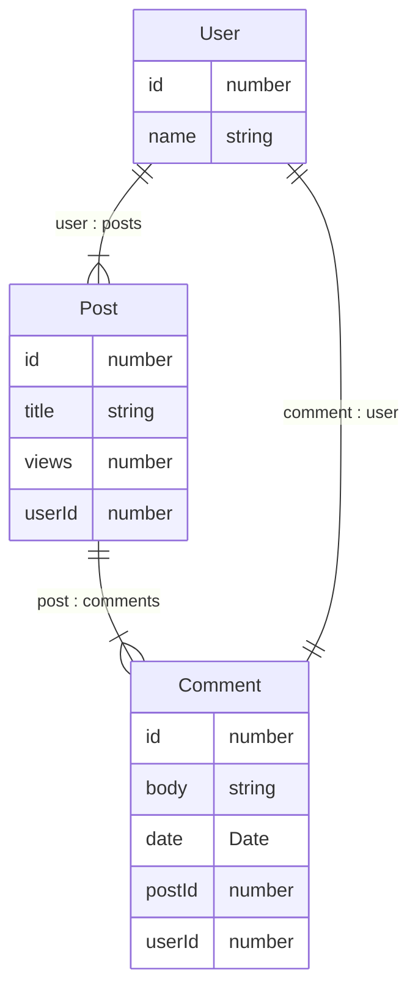

# 各リポジトリ説明

この apollo federation の gateway リポジトリは、他に下記の subgraph から構成されています。

- [gql-user-server](https://github.com/yuyakinjo/gql-user-server): ユーザー情報を管理する subgraph です。

- [gql-post-server](https://github.com/yuyakinjo/gql-post-server): 投稿情報を管理する subgraph です。
- [gql-comment-server](https://github.com/yuyakinjo/gql-comment-server): コメント情報を管理する subgraph です。

これらの subgraph は、gateway リポジトリを介して連携し、クライアントからのリクエストを処理し、データを取得することができます。

# ER 図

- [gql-gateway](https://github.com/yuyakinjo/gql-gateway): 上記をまとめる gateway です。

